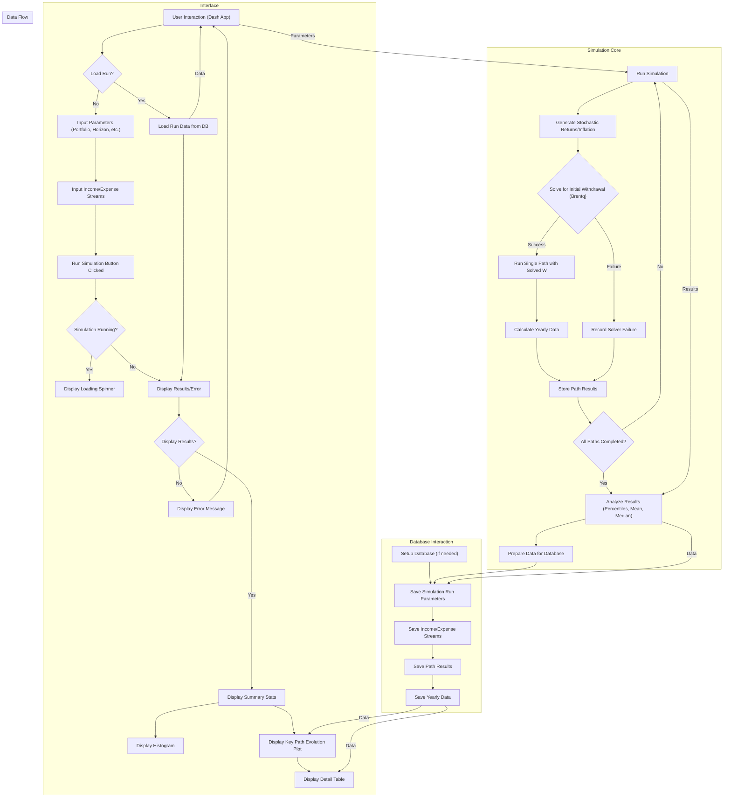

# Retirement Scenario Simulator

This project is a Monte Carlo-based simulation tool designed to help users model and analyze various retirement scenarios. It allows for detailed input of financial parameters, income streams, and expense streams to project long-term financial health under stochastic market conditions.

## Key Features

*   **Web Interface (Dash App)**: Provides an interactive dashboard (`app_v4.py`) for setting up simulation parameters, defining income/expense streams, running simulations, and visualizing results (histograms of outcomes, time-series projections of key financial paths).
*   **Core Simulation Engine**: The `simulator_engine.py` script contains the underlying logic for performing Monte Carlo simulations. It generates stochastic market returns and inflation, solves for optimal initial withdrawal amounts, and simulates financial trajectories over a defined horizon.
*   **Database Storage**: Simulation configurations and detailed results (including yearly path data) are stored in an SQLite database (`retirement_sim.db`), allowing for review and analysis of past scenarios.
*   **Command-Line Result Viewers**: Scripts like `load_simulation_results.py` and `load_simulation_results_v2.py` offer a command-line interface to list and display detailed results from previously saved simulation runs.
*   **Customizable Inputs**: Users can define:
    *   Initial portfolio value, planning horizon, and target end balances.
    *   Assumptions for market returns and inflation (including means and standard deviations, with separate long-term inflation parameters).
    *   Multiple, configurable income streams (e.g., Social Security, pensions) with varying start/end years, amounts, and inflation adjustment rules.
    *   Multiple, configurable expense streams (e.g., living costs, travel, healthcare) with similar customization options.
*   **Stochastic Modeling**: Utilizes random sampling for market returns and inflation to model a wide range of potential financial futures.
*   **Withdrawal Optimization**: Employs a numerical solver (Brentq) to find an initial total withdrawal amount that aims to meet a user-defined target end balance in today's dollars.

## Project Structure

The project is organized into the following key files:

*   `app_v4.py`: The main Dash web application. It provides the user interface for interacting with the simulator, setting parameters, and viewing results graphically.
*   `simulator_engine.py`: The core backend logic for the retirement simulations. It handles stochastic data generation, path simulations, financial calculations, withdrawal optimization, and database interactions for saving/loading simulation data.
*   `load_simulation_results.py` & `load_simulation_results_v2.py`: Command-line scripts to load, parse, and display results from simulations stored in the database. `load_simulation_results_v2.py` is likely the more current version, aligned with `app_v4.py` and `simulator_engine.py` V4/V5 features.
*   `retirement_sim.db`: An SQLite database file where all simulation parameters, detailed path results, and yearly financial data for each path are stored. This file will be created automatically when `simulator_engine.py` or `app_v4.py` is run for the first time.
*   `graph TD.md`: A Markdown file containing a Mermaid diagram that outlines the system architecture and data flow within the application.
*   `.gitignore`: Specifies intentionally untracked files that Git should ignore (e.g., `__pycache__`, `*.db-journal`).
*   `README.md`: This file, providing an overview and instructions for the project.

## Setup and Usage

### Prerequisites

*   Python (likely 3.7+ as it's common for the libraries used)
*   The following Python libraries:
    *   Dash (`dash`, `dash-bootstrap-components`, `dash_table`)
    *   Plotly (`plotly`)
    *   Pandas (`pandas`)
    *   NumPy (`numpy`)
    *   SciPy (`scipy`)

### Installation

1.  **Clone the repository (if applicable):**
    ```bash
    git clone <repository-url>
    cd <repository-directory>
    ```
2.  **Create and activate a virtual environment (recommended):**
    ```bash
    python -m venv venv
    # On Windows
    # venv\Scripts\activate
    # On macOS/Linux
    # source venv/bin/activate
    ```
3.  **Install dependencies:**
    It's recommended to create a `requirements.txt` file. Based on the imports, it would look something like this:
    ```
    dash
    dash-bootstrap-components
    dash_table
    plotly
    pandas
    numpy
    scipy
    ```
    You can then install them using:
    ```bash
    pip install -r requirements.txt
    ```
    Alternatively, you can install them individually:
    ```bash
    pip install dash dash-bootstrap-components dash_table plotly pandas numpy scipy
    ```

### Running the Web Application

1.  Ensure your terminal is in the project's root directory and your virtual environment (if used) is activated.
2.  The `simulator_engine.py` will automatically create the `retirement_sim.db` SQLite database file if it doesn't exist when the application or engine is first run.
3.  Start the Dash application:
    ```bash
    python app_v4.py
    ```
4.  Open your web browser and navigate to the address shown in the terminal (usually `http://127.0.0.1:8050/`).

### Using the Command-Line Tools

The command-line tools (`load_simulation_results.py` and `load_simulation_results_v2.py`) can be used to view results from simulations stored in `retirement_sim.db`.

1.  Ensure your terminal is in the project's root directory.
2.  Run the script, for example:
    ```bash
    python load_simulation_results_v2.py
    ```
3.  The script will typically list available simulation runs and prompt you to enter a `RunID` to view its detailed results.

## Simulation Engine (`simulator_engine.py`)

The `simulator_engine.py` script is the heart of this retirement planning tool. It's responsible for:

*   **Database Management**: Initializes the SQLite database (`retirement_sim.db`) with the necessary tables (SimulationRuns, IncomeStreams, Expenses, PathResults, PathYearlyData) and handles saving and retrieving simulation data.
*   **Stochastic Data Generation**: Creates random sequences of market returns and inflation rates for a specified number of simulation paths and a given time horizon. It supports different inflation characteristics for the initial years versus long-term.
*   **Financial Modeling**: For each simulation path:
    *   Calculates year-by-year financial progression, accounting for portfolio growth, income, expenses, and withdrawals.
    *   Adjusts income and expense streams for inflation according to defined rules.
*   **Withdrawal Optimization**: Implements a numerical solver (SciPy's `brentq` function) to determine an optimal initial *total withdrawal amount*. The solver aims to achieve a user-defined target portfolio balance (in today's dollars) at the end of the simulation horizon. It considers a specified min/max percentage of the initial portfolio for this withdrawal.
*   **Path Simulation**: Runs individual simulation paths using the solved withdrawal rate (or explores outcomes if the solver doesn't converge optimally).
*   **Data Aggregation and Storage**: Collects detailed yearly data for key percentile paths (e.g., 10th, 25th, 50th, 75th, 90th percentile outcomes) and summary statistics for all paths. All this information, along with the input parameters, is saved to the database for later analysis via the Dash app or CLI tools.

## Database Schema (`retirement_sim.db`)

The `retirement_sim.db` SQLite database stores all the data related to simulation runs. The key tables are:

*   **`SimulationRuns`**: Stores the overall parameters for each simulation run, such as initial portfolio value, simulation horizon, return/inflation assumptions, target balances, number of paths, notes, and a timestamp for the run.
*   **`IncomeStreams`**: Details for each income stream associated with a simulation run, including its type, start/end year offsets, initial amount, and inflation adjustment rule.
*   **`Expenses`**: Details for each expense stream, similar to income streams, specifying type, start/end years, initial amount, and inflation adjustment.
*   **`PathResults`**: Contains summary results for each individual simulation path within a run. This includes the solved initial withdrawal (if successful), path status (e.g., success, solver error), final portfolio balance (nominal and today's dollars), and cumulative inflation. It also flags key percentile paths.
*   **`PathYearlyData`**: Stores detailed year-by-year financial data for the key percentile paths. This includes start-of-year balance, total income, total expenses, total withdrawal taken, market return, inflation for the year, and end-of-year balance. This table enables the detailed time-series visualizations in the Dash app.

The database is designed to be self-contained, with relationships enforced by `RunID` and `ResultID` foreign keys to ensure data integrity.

## System Architecture

The following diagram illustrates the overall architecture and data flow of the Retirement Scenario Simulator:



*This diagram is defined in `graph TD.md`.*

## Future Enhancements / To-Do

*   **`requirements.txt`**: Create and maintain a `requirements.txt` file for easier dependency management.
*   **Taxation Modeling**: Incorporate more sophisticated tax calculations (e.g., capital gains, income tax brackets) into the simulation.
*   **Advanced Financial Products**: Allow modeling of more complex financial instruments or accounts (e.g., annuities, Roth vs. traditional accounts with different tax implications on withdrawal).
*   **Sensitivity Analysis**: Add features to easily run sensitivity analyses on key assumptions (e.g., how results change with a 1% change in average returns).
*   **User Authentication/Accounts**: If deployed as a shared web service, add user accounts to save and manage individual simulation scenarios privately.
*   **Improved Error Handling and Logging**: Enhance error reporting in both the UI and the engine.
*   **Unit and Integration Tests**: Develop a suite of tests to ensure the reliability and correctness of the simulation engine and UI components.
*   **More Granular Inflation Rules**: Allow different inflation adjustment rules for specific income/expense streams rather than just a general rule. (Partially implemented, but could be expanded).
*   **UI/UX Enhancements**: Continue to refine the Dash application for better usability and more insightful visualizations.
